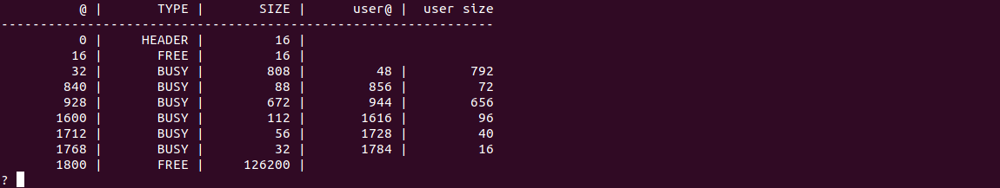

	 
	 
	
	<h1>Mnemosyne (TP-Memoire)</h1>
	

	
A memory allocator made in c

	

	 

## Screenshot

  

## Source content
- **`mem.h` et `mem_os.h` :** the interface of the allocator.
  `mem.h` defines user functions (`mem_alloc`, `mem_free`), 
   mem_os.h` defines the functions defining the allocation strategy

- **`common.h` et `common.c` :** define the memory to be managed and utility functions to know its size and start address.
  
- **`memshell.c`:** a simple interpreter of allocation and release commands allowing to test the allocator in an interactive way.
  
- **`mem.c` :** contains most of the code for allocating and freeing memory.
- **`malloc_stub.h` et `malloc_stub.c` :** used to generate a library to replace the `libc` and test your to replace the `libc` and to test the allocator with existing standard programs.
